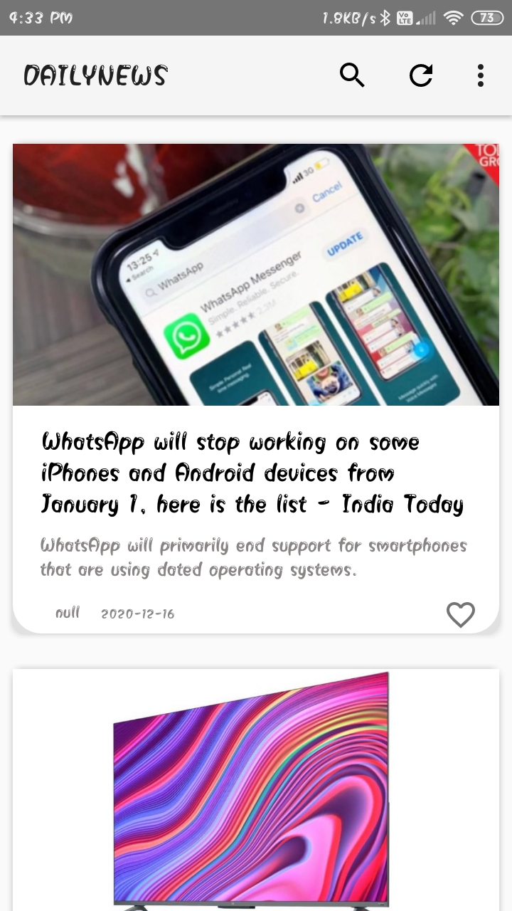

# NewsApp

### Concepts of RecyclerView for scrolling, Volley Library & Glide Library for API Call, Chrome Custom Tabs to stay inside the app during the uses time and concepts of intent to execute a different activity are used accordingly. I made an app icon, also added a SplashScreen to give a little more lively vibe of the app.

### Icone    &   Splash Screen
       

### Select News    &   Health News
            

### Tech News    &   Sport News
       

### Sport news in detail 
     
